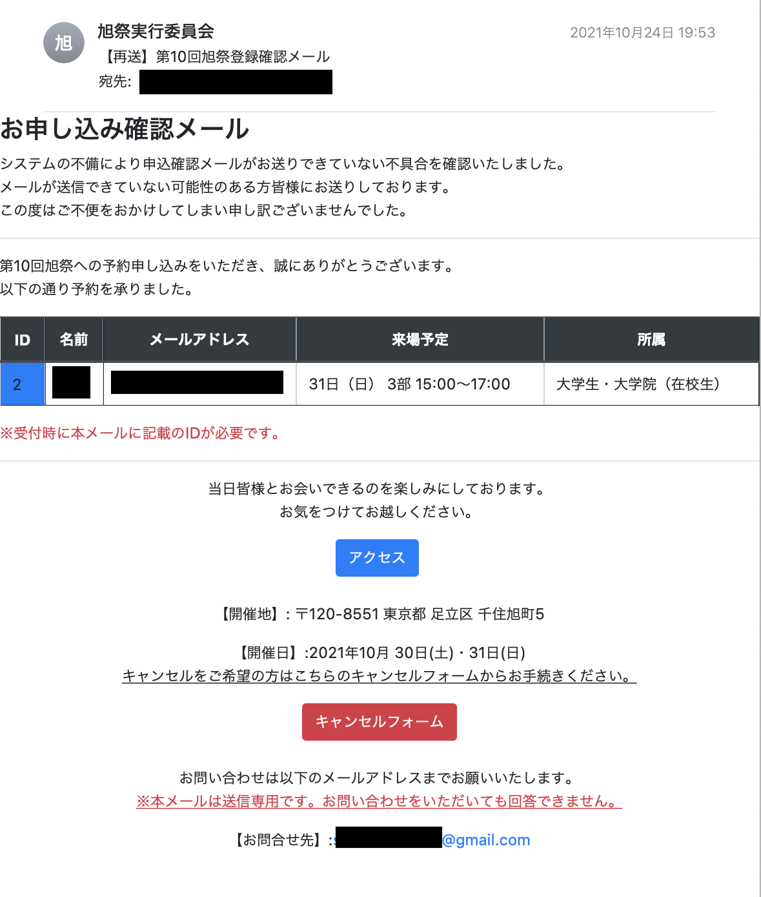

# GoogleFormsAutoMails

## 概要
第10回旭祭はyoutubeで配信するオンライン型と東京千住キャンパスで行う対面型(オンキャンパス)のハイブリッドで開催した。

本リポジトリはオンキャンパスに参加を希望された方に向けて一斉にメールを送信するためのスクリプトおよび送信したHTMLメールのbodyである.


募集人数の上限は以下の通り.
<div style="text-align: center;">

|  募集人数  |  30日 |  31日  |
| ---- | ---- | ---- |
|  1ターム  |  300人  |  300人  |
|  2ターム  |  300人  |  300人  |
|  3ターム  |  300人  |  300人  |

</div>

---
## あらすじ
参加を希望される方には事前にGoogle Formsに申込みをいただいた。
私が関わる前は[Email Notifications for Forms](https://workspace.google.com/marketplace/app/email_notifications_for_google_forms/984866591130)なるGoogleFormsのaddonを利用して、予約確認メールを自動送信していた.

しかし、Freeプランでは1日に送ることのできるメールの上限が20件程度と少なく,確認メールが届かないため、重複予約を行う来場希望者が急増.そのことに気がつくのが送れたため,予約の大量重複,個別のメール問い合わせが急増した.

ひとまず対策として,addonのプランを有料プランに変更した.ここでそれまでに予約してくださっていた来場予定者へ一斉にメールを送る必要がでてきたため,今回のスクリプトを書くことに...


Formsにて収集したメールアドレスに対して申込情報の確認を行うメールを送信する.

---

## 実際に送信したメールのBodyおよびスクリプト
``` 
    mail.html・・・送信したメールの本文
    mail.js・・・sendmailを実行することでメールを送信することが可能(便宜上jsになっているが本当はgs)
```



